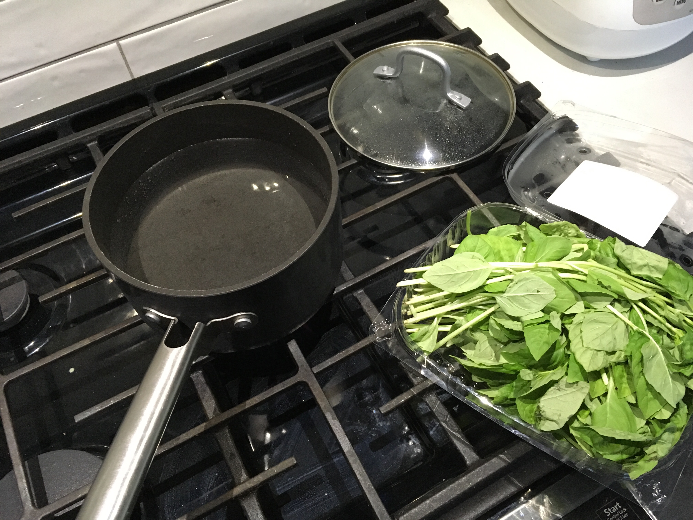

# Veggie Pesto Pizza

Half wild-crafted/hand-foraged. Half supermarket stock.

- Brown pine nuts in a pan.
- Use about a large handful. Image below is a subset.
- Just nuts in pan. No oil. (Photo is misleading.)

- Add extra virgin olive oil.

- Boil water to blanch the basil.
Blanching will keep it from going brown.
And can affect taste.

- Protect hands from steam.
- Or use dedicated strainer thingie.

- Submerge for about 5-7 seconds. Not 10. You might see the basil go darker green which is good.

- Let it drain and cool.

- Squeeze out water.
- Rip off the leaves - one big twist.
- Discard stems. YMMV. Try it sometime with stems for more volume, but see how you like the taste.

- Reggiano Parmesan. About that much, on the left.

- Used to use much more garlic but the sig-other has asked for a cutback. To your taste.

- Blend.
- Mortar & pestle just to look bougie.

- Blended. Not smooth.

- You'll have extra you can freeze.

- Your cut broccoli and mozzarella. I use the ~$5 whole milk cheese. You can get fancy stuff if you like but those are hit and miss.

- Lubricate yourself.

- Crusts from Trader Joe's if you don't want to make your own. (Do not use clam juice!)

- Use pizza shell as sizing guide for broccoli. I do super-full, nearing a second layer.
- In other words, load your raw broccoli from the left bowl into the crust. Then move it to the right bowl for the oil job.

- Hand toss apportioned broccoli with oil.

- Cut your additional stuff like cheese 'n tomatoes.

- Apply pesto.

- Apply fromage.

- Top.
- I only add crushed red peppers. There is *plenty* of oil and salt in the cheeses and crust.

- Enjoy.

